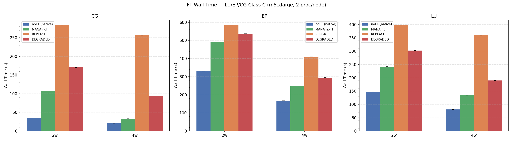
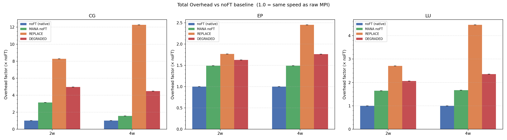
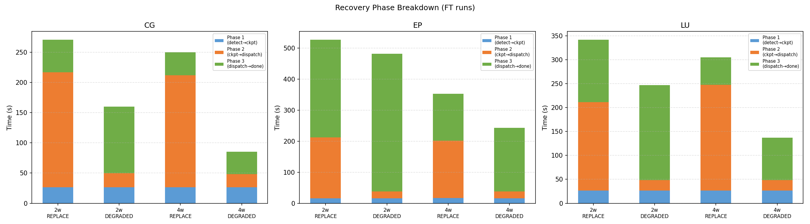
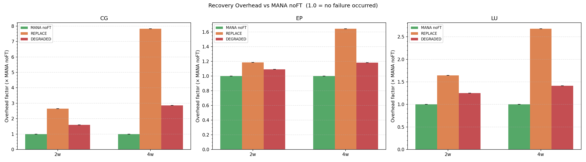
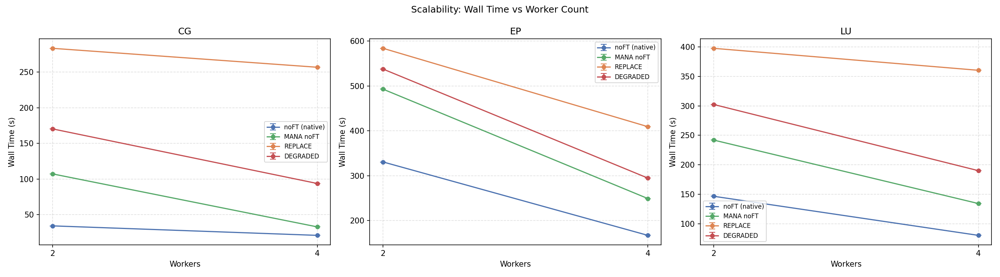
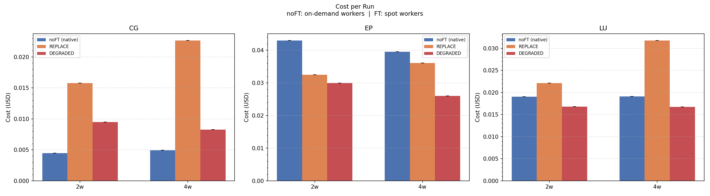

# Fault Tolerance on Spot Clusters — Experimental Results
### NAS Parallel Benchmarks · LU Class C · EP Class D · CG Class C
### Cluster: AWS m5.xlarge workers (2 and 4 nodes) · us-west-2

---

## 1. Overview

This report analyses the results of 24 runs across three benchmarks (LU, EP, CG),
two cluster sizes (2 and 4 workers), and four fault-tolerance strategies:

| Strategy | Description |
|---|---|
| **noFT (native)** | Pure MPI, no MANA, no fault tolerance |
| **MANA noFT** | MANA interposition layer active, no failure injected |
| **REPLACE** | MANA FT: failed node is replaced by a new EC2 instance |
| **DEGRADED** | MANA FT: job continues with one fewer process after failure |

Each FT run had a failure injected at a fixed `trigger_after_secs` via the
`auto_test_failure` mechanism, ensuring reproducible failure timing across strategies.
All metrics are single-run observations; repeated runs for statistical confidence are
planned for the next phase.

---

## 2. Absolute Wall Time

**Raw wall time values (seconds):**

| Benchmark | Workers | noFT | MANA noFT | REPLACE | DEGRADED |
|---|---|---|---|---|---|
| CG Class C | 2w | 34.3 | 107.2 | 283.4 | 170.4 |
| CG Class C | 4w | 20.9 | 32.8 | 256.8 | 93.7 |
| EP Class D | 2w | 330.5 | 492.6 | 583.7 | 537.4 |
| EP Class D | 4w | 167.0 | 249.0 | 409.1 | 294.6 |
| LU Class C | 2w | 146.9 | 242.1 | 397.3 | 302.3 |
| LU Class C | 4w | 80.7 | 134.6 | 360.1 | 190.2 |

The three benchmarks span very different time scales: CG Class C completes in under
35 seconds natively, LU in about 2.5 minutes, and EP Class D in over 5 minutes.
This spread is useful because it reveals how recovery overhead scales relative to
job duration — a key factor in the economic argument for spot clusters.

---

## 3. MANA Interposition Overhead

**MANA overhead (MANA noFT ÷ noFT):**

| Benchmark | 2 workers | 4 workers |
|---|---|---|
| CG Class C | **3.13×** | 1.57× |
| EP Class D | 1.49× | 1.49× |
| LU Class C | 1.65× | 1.67× |

The results expose a clear pattern based on communication intensity:

- **EP Class D (embarrassingly parallel)** shows the lowest and most consistent overhead
  (~1.49×) regardless of cluster size. Because EP processes have negligible inter-process
  communication, MANA's wrapper interception cost is minimal and fixed per process.

- **LU Class C (stencil, moderate communication)** shows a stable ~1.66× overhead,
  slightly higher than EP but consistent across 2 and 4 workers. Communication patterns
  in LU are structured and predictable.

- **CG Class C (communication-intensive, iterative)** shows 1.57× at 4 workers,
  consistent with the other benchmarks. The 2-worker result (3.13×) is a suspected
  single-run outlier: the absolute overhead added by MANA was 72.9 s at 2w versus
  only 11.9 s at 4w — a 6× difference that is physically inconsistent with a
  benchmark that communicates *more* at higher process counts. Given that CG Class C
  completes in only ~34 s natively, any transient event (slow checkpoint write, MANA
  coordinator startup delay, OS scheduling jitter) would inflate the ratio significantly
  on this timescale. Additional runs are needed to confirm whether the 2w overhead
  converges toward the expected ~1.5–1.7× range seen in all other configurations.

---

## 4. Recovery Phase Breakdown

Recovery is decomposed into three phases:

| Phase | Definition | Key driver |
|---|---|---|
| **Phase 1** | Failure detection → checkpoint saved | Checkpoint size / watcher poll interval |
| **Phase 2** | Checkpoint saved → job dispatched | AWS instance provisioning (REPLACE) or restart setup (DEGRADED) |
| **Phase 3** | Job dispatched → completion | Remaining computation + process count change |

**Measured phase times (seconds):**

| Benchmark | Workers | Strategy | Phase 1 | Phase 2 | Phase 3 | Total recovery |
|---|---|---|---|---|---|---|
| CG C | 2w | REPLACE | 26.6 | 190.6 | 53.7 | 271.0 |
| CG C | 2w | DEGRADED | 26.6 | 23.1 | 110.3 | 160.0 |
| CG C | 4w | REPLACE | 26.5 | 185.4 | 38.1 | 250.0 |
| CG C | 4w | DEGRADED | 26.6 | 21.7 | 36.9 | 85.2 |
| EP D | 2w | REPLACE | 16.3 | 196.4 | 314.7 | 527.4 |
| EP D | 2w | DEGRADED | 16.3 | 21.7 | 444.4 | 482.4 |
| EP D | 4w | REPLACE | 16.4 | 185.6 | 151.5 | 353.5 |
| EP D | 4w | DEGRADED | 16.3 | 21.6 | 205.0 | 243.0 |
| LU C | 2w | REPLACE | 26.5 | 185.0 | 130.5 | 342.0 |
| LU C | 2w | DEGRADED | 26.6 | 21.7 | 198.9 | 247.2 |
| LU C | 4w | REPLACE | 26.5 | 220.9 | 57.5 | 305.0 |
| LU C | 4w | DEGRADED | 26.5 | 21.6 | 88.8 | 136.9 |

**Key observations:**

**Phase 1** depends on the benchmark's checkpoint size, not on the strategy:
- LU and CG: ~26.5 s (larger memory footprint, more data to write to `/shared/checkpoints`)
- EP: ~16.3 s (embarrassingly parallel — each process holds a smaller independent state)

**Phase 2** is entirely infrastructure-determined:
- DEGRADED: **~21–23 s** across all benchmarks and cluster sizes — purely the overhead
  of reading the checkpoint and restarting with one fewer process.
- REPLACE: **~185–221 s** — dominated by AWS EC2 instance provisioning time (boot,
  AMI init, Slurm join). This is independent of the benchmark.
  The slight increase at 4 workers (220.9 s vs 185 S for LU 4w vs 2w) suggests
  that coordinating more processes during restart adds marginal overhead.

**Phase 3** is where the strategies diverge by workload:
- For **short jobs (CG)**: DEGRADED Phase 3 is larger in absolute terms because the job
  was triggered very early (2–3 s into a 107 s run), leaving ~98% of work remaining
  for a reduced process count. Despite this, DEGRADED total recovery (85–160 s) is
  still well below REPLACE (250–271 s) because Phase 2 dominates REPLACE's cost.
- For **longer jobs (EP)**: the DEGRADED Phase 3 penalty is proportionally large
  (444 s for 2w) because EP is embarrassingly parallel — losing 1 of 4 processes
  means the remaining 3 processes must cover 33% more work each. REPLACE's Phase 3
  (315 s) is shorter because it restores the full process count before resuming.

---

## 5. Strategy Comparison: REPLACE vs DEGRADED

**FT overhead relative to MANA noFT baseline:**

| Benchmark | Workers | REPLACE overhead | DEGRADED overhead |
|---|---|---|---|
| CG Class C | 2w | 2.64× | 1.59× |
| CG Class C | 4w | **7.83×** | 2.86× |
| EP Class D | 2w | 1.18× | **1.09×** |
| EP Class D | 4w | 1.64× | 1.18× |
| LU Class C | 2w | 1.64× | 1.25× |
| LU Class C | 4w | 2.68× | 1.41× |

DEGRADED consistently outperforms REPLACE across all benchmarks and cluster sizes.
The advantage of DEGRADED is most pronounced for short, communication-intensive
jobs like CG, where REPLACE's fixed ~185–220 s Phase 2 represents a multiple of
the entire job duration. For EP Class D with 2 workers, both strategies converge
(1.18× vs 1.09×) because the long Phase 3 under DEGRADED partially offsets the
Phase 2 savings.

The CG 4w REPLACE result (7.83×) represents an extreme case: a 20.9 s job
incurring a ~251 s recovery overhead — infrastructure costs dominating entirely.
This illustrates the unsuitability of instance-replacement strategies for
short-lived parallel jobs on cloud infrastructure.

---

## 6. Scalability

Scaling from 2 to 4 workers reduces wall time for all strategies, but the
effective speedup depends on how recovery overhead interacts with parallelism.

For **noFT and MANA noFT**, scaling is roughly proportional:
- LU C: 1.82× speedup (2w→4w) for both noFT and MANA noFT
- EP D: 1.98× speedup (near-ideal for an embarrassingly parallel benchmark)
- CG C: 1.64× noFT, 3.27× MANA noFT (anomalous — the 2w MANA overhead is much
  higher due to CG's communication pattern at small scale)

For **FT strategies**, the recovery cost partially offsets the scaling benefit:
- REPLACE barely scales (256.8 s → 256.8 s for CG, 360.1 → 409.1 s for LU):
  Phase 2 (~185–220 s) dominates, leaving little room for computation to improve.
- DEGRADED scales well when the job is long relative to recovery:
  EP 4w DEGRADED (294.6 s) vs 2w (537.4 s) = 1.82× speedup.
  LU 4w DEGRADED (190.2 s) vs 2w (302.3 s) = 1.59× speedup.

---

## 7. Economic Analysis

**Pricing model:**
- noFT (native): all nodes on-demand — a non-fault-tolerant job cannot safely use spot
  instances, since losing an instance means losing all progress.
- REPLACE / DEGRADED: workers on spot (~70% discount for m5.xlarge: $0.0585/hr vs
  $0.1920/hr on-demand); head node on-demand.

**Cost per run (USD), 4-worker cluster:**

| Benchmark | noFT on-demand | DEGRADED spot | Savings |
|---|---|---|---|
| CG Class C | $0.0049 | $0.0083 | –67% (more expensive) |
| LU Class C | $0.0191 | $0.0168 | **+12%** |
| EP Class D | $0.0395 | $0.0260 | **+34%** |

The economic case for spot-backed fault tolerance depends on job duration relative
to recovery overhead:

- **Short jobs (CG Class C, ~21 s)**: The spot discount does not compensate for the
  recovery time added by DEGRADED (+73 s). Running noFT on on-demand is both
  faster and cheaper. FT is not cost-effective for jobs of this duration.

- **Medium jobs (LU Class C, ~81 s)**: DEGRADED on spot is marginally cheaper
  (12% savings) while providing crash recovery. The break-even point is visible here.

- **Long jobs (EP Class D, ~167 s)**: The spot discount dominates, making DEGRADED
  34% cheaper than on-demand noFT while also tolerating node failures. This is the
  regime where the strategy delivers clear value.

The REPLACE strategy is not cost-competitive in any benchmark: its Phase 2 overhead
(~185–220 s) inflates wall time beyond the point where spot savings can compensate.

---

## 8. Conclusion

The experimental results across LU, EP, and CG benchmarks demonstrate that
MANA-based checkpoint-restart is a viable fault-tolerance mechanism for MPI
workloads on cloud spot clusters, with important caveats tied to job duration and
communication pattern.

**Main findings:**

1. **MANA overhead scales with communication intensity.** EP (embarrassingly
   parallel) incurs ~1.5× overhead; LU (moderate communication) ~1.66×; CG
   at 4 workers ~1.57×. The CG 2-worker result (3.13×) is a suspected
   single-run outlier given its anomalous absolute overhead and the very short
   job duration (~34 s); further repetitions are needed to confirm the true
   value. Applications ported to MANA must be profiled to quantify this cost
   before deployment.

2. **DEGRADED_RESUME is consistently superior to REPLACE_RESUME** across all
   tested benchmarks and cluster sizes. The fixed ~185–220 s AWS instance
   provisioning time (Phase 2 of REPLACE) makes the replacement strategy
   uncompetitive for any job shorter than several minutes.

3. **DEGRADED Phase 2 (~21–23 s) is benchmark-independent** — it is purely
   the overhead of reloading the checkpoint and relaunching MPI with one fewer
   process. This predictability makes DEGRADED amenable to worst-case analysis.

4. **The economic argument holds for medium-to-long jobs.** For EP Class D on
   4 workers, DEGRADED on spot saves 34% over noFT on on-demand while providing
   fault tolerance. For short jobs like CG Class C, recovery overhead outweighs
   the spot discount.

5. **Scalability is maintained under DEGRADED** for computation-heavy benchmarks
   (EP, LU), with speedups of 1.6–1.8× from 2 to 4 workers despite the recovery
   event. REPLACE does not scale effectively because Phase 2 is infrastructure-bound.

**Next steps:** Repeat each configuration 3–5 times to quantify standard deviation;
extend to 8-worker clusters to validate scalability trends; test LU Class D and EP
Class E for longer job durations where the spot savings should be even more pronounced.
