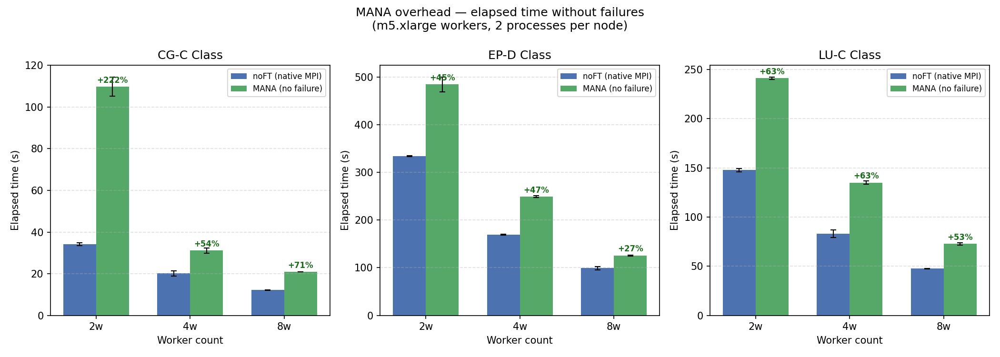
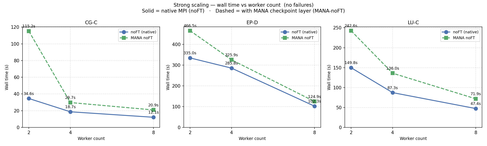
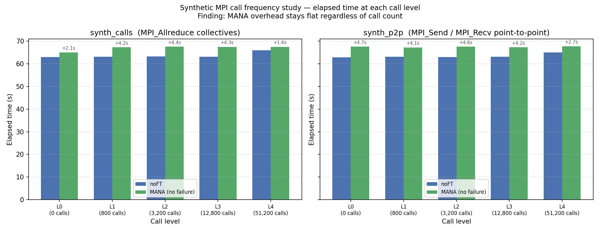
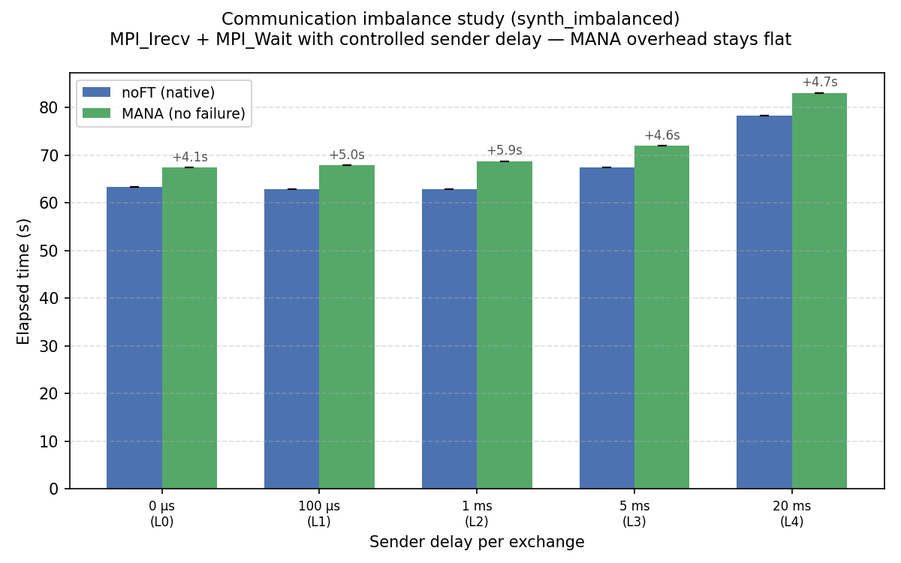
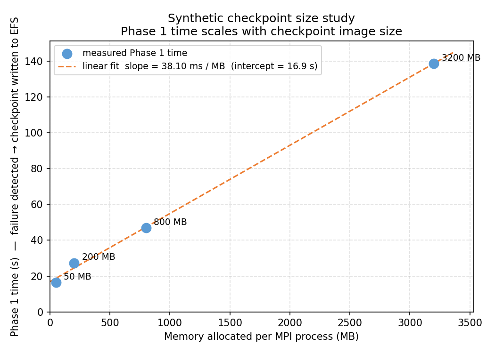
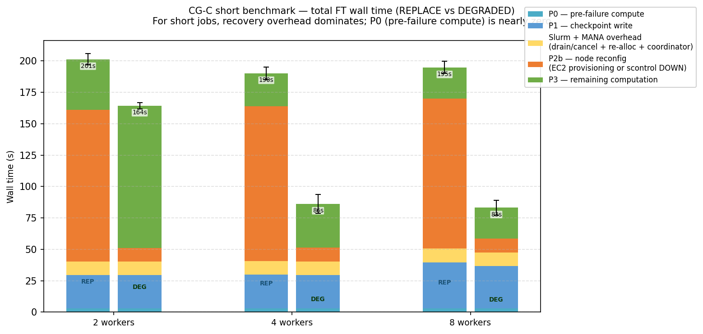
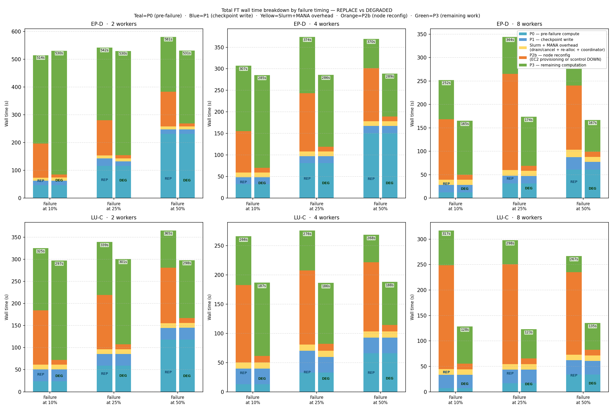
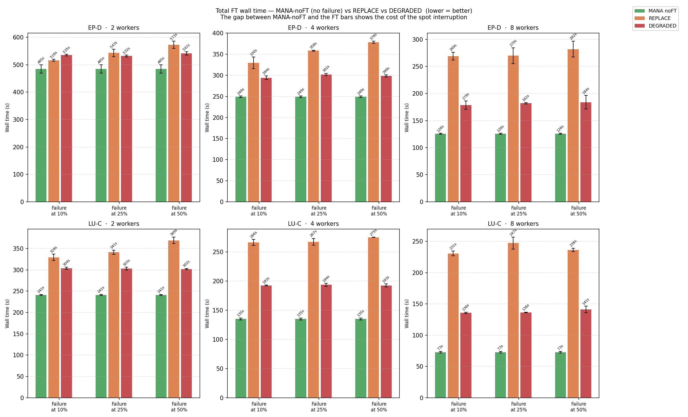
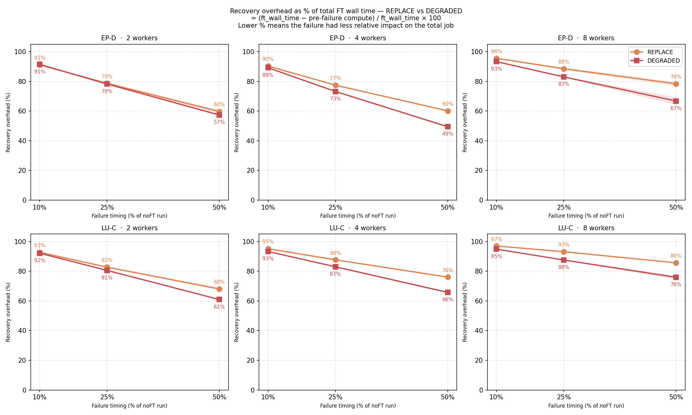
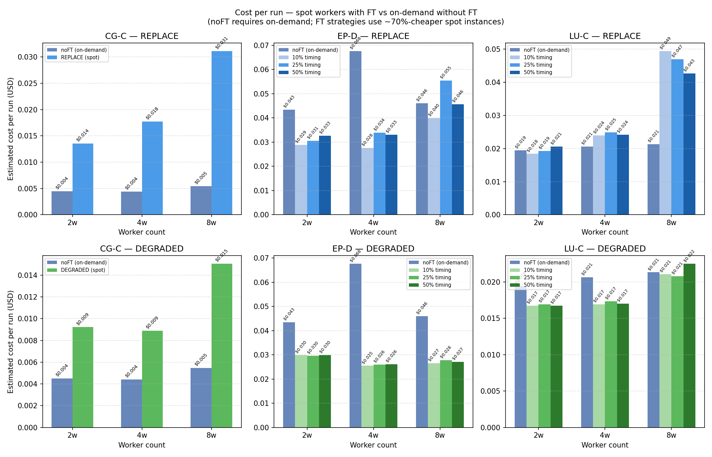

# Relatório de Análise da Fase 5 — Aprofundando a Avaliação de Tolerância a Falhas
### Mecanismos de Sobrecarga (Overhead) do MANA · Tamanho do Checkpoint · Sensibilidade ao Momento da Falha
### Cluster: Máquinas AWS m5.xlarge (2 / 4 / 8 nós) · Região us-west-2

---

## 1. Visão Geral

Este relatório apresenta os resultados completos dos experimentos da Fase 5. Esta etapa expande os testes pilotos da Fase 4 em três frentes principais:

| Estudo | Objetivo | Execuções |
|---|---|---|
| **5.1 Overhead sintético do MPI** | Isolar se o que causa a lentidão (overhead) do MANA é a frequência de comunicação ou o desequilíbrio na comunicação. | 30 |
| **5.2 Tamanho do checkpoint sintético** | Medir como o tamanho da imagem salva (checkpoint) afeta o tempo da Fase 1 (detectar a falha → salvar o checkpoint). | 4 |
| **5.3 Sensibilidade ao momento da falha** | Avaliar como o momento em que a falha ocorre durante o trabalho afeta a escolha entre as estratégias REPLACE (Substituir) e DEGRADED (Degradar). | 36 |
| **Linhas de base (Refazendo a Fase 4)** | Execuções normais (noFT) e com MANA (MANA-noFT) para todos os 3 benchmarks × 3 tamanhos de cluster, agora com novas medições. | 24 |

**Total: 94 execuções bem-sucedidas.** Todos os resultados foram coletados em instâncias spot AWS m5.xlarge (4 vCPUs, 16 GB de RAM) na região us-west-2. O nó principal (head node) foi uma instância t3.large sob demanda. Cada teste usou o mecanismo `auto_test_failure` para garantir que as falhas fossem injetadas de forma reprodutível.

Novidade da Fase 5: a recuperação agora mede **três subfases da Fase 2**:
- **Fase 2a** — Drenagem do Slurm + cancelamento do job (~5,5 s, idêntico para ambas as estratégias).
- **Fase 2b** — Reconfiguração do nó: Criar uma nova máquina EC2 para a estratégia REPLACE (~122–157 s) vs. usar o comando `scontrol DOWN` para a estratégia DEGRADED (~11 s).
- **Fase 2c** — Nova alocação no Slurm + configuração do coordenador MANA (~5,3 s, idêntico para ambas).

---

## 2. Sobrecarga (Overhead) do MANA Sem Falhas



**Tabela 1 — Overhead do MANA (Tempo total MANA-noFT vs noFT):**

| Benchmark | 2 workers | 4 workers | 8 workers |
|---|---|---|---|
| CG-C | +233% | +59% | +73% |
| EP-D | +39% | +14% | +22% |
| LU-C | +62% | +56% | +52% |

Esses números devem ser lidos com cuidado. Cada valor é a diferença entre duas execuções separadas (uma normal e outra com MANA), feitas em momentos diferentes na infraestrutura da nuvem (EC2). Como a nuvem tem variações naturais de desempenho (ruído de rede, uso de CPU por outros clientes), essa medição mostra a diferença total, e não apenas a "culpa" exata do MANA. 

O LU-C é o caso mais estável (52–62% em todos os tamanhos). O programa EP-D não deve ser usado como base definitiva aqui, pois a grande diferença em 2 máquinas provavelmente é ruído da nuvem.

### 2.1 Anomalia no CG-C com 2 Trabalhadores (Workers)
O CG com 2 máquinas mostra um atraso gigante de +233% (pula de 34,6 s para 115,2 s), mas com 4 máquinas o atraso é de apenas +59%. Isso não faz sentido fisicamente, já que com menos máquinas o programa deveria fazer mais iterações por processo. A hipótese mais provável é um "efeito cascata": o leve atraso que o MANA gera faz um processo terminar mais tarde, obrigando o parceiro a ficar esperando e gastando processamento à toa. Com 4 ou 8 máquinas, a divisão do trabalho muda e esse gargalo some.

---

## 3. Escalabilidade Forte (Strong Scaling)



**Tabela 2 — Tempo total (segundos) vs. quantidade de workers, noFT e MANA-noFT:**

| Benchmark | noFT 2w | noFT 4w | noFT 8w | Aceleração 2→8 | MANA 2w | MANA 4w | MANA 8w |
|---|---|---|---|---|---|---|---|
| CG-C | 34.6 | 18.7 | 12.1 | 2.9× | 115.2 | 29.7 | 20.9 |
| EP-D | 335.0 | 285.8 | 102.3 | 3.3× | 466.5 | 325.9 | 124.9 |
| LU-C | 149.8 | 87.3 | 47.4 | 3.2× | 242.6 | 136.0 | 71.9 |

O resultado principal aqui é que **o MANA segue a mesma curva de escalabilidade que o programa original (noFT)**. Ou seja, o overhead não piora desproporcionalmente quando usamos mais máquinas. A infraestrutura de checkpoint do MANA não se torna um gargalo para clusters maiores.

---

## 4. Mecanismos de Overhead do MANA — Estudos Sintéticos

Os benchmarks reais misturam computação, comunicação e efeitos do cluster de maneiras que dificultam isolar *o que* causa a lentidão do MANA. Por isso, desenvolvemos quatro programas sintéticos (artificiais) desenhados para testar uma variável por vez.

### 4.1 Estudo de Frequência de Chamadas
**O que testamos:** Avaliar se o MANA fica mais lento de acordo com a quantidade de vezes que o programa aciona funções de comunicação do MPI. Criamos duas variações: uma para comunicação coletiva (todos com todos) e outra para comunicação ponto a ponto (pares de processos).

**Comunicação Coletiva (`synth_mpi_calls`):** Usa o `MPI_Allreduce`, que faz todas as máquinas simultaneamente contribuírem com um valor e receberem o resultado global (por exemplo, a soma de todos os processos). É a operação usada pelo EP. O programa faz uma quantidade fixa de cálculos e varia apenas a frequência com que chama o `MPI_Allreduce`:

```c
for (long outer = 0; outer < TOTAL_OUTER; outer++) {
    for (long i = 0; i < INNER_ITERS; i++)
        x = x * 1.0000001 + 1e-10;          /* mesma quantidade de cálculo em todos os níveis */
    if (call_period > 0 && outer % call_period == 0) {
        MPI_Allreduce(&x, &result, 1, MPI_DOUBLE, MPI_SUM, MPI_COMM_WORLD);
        x += result * 1e-20;
    }
}
```

**Comunicação Ponto a Ponto (`synth_p2p`):** Usa `MPI_Send` e `MPI_Recv`, que são operações bloqueantes entre pares específicos de processos. O `MPI_Send` bloqueia o remetente até a mensagem ser entregue; o `MPI_Recv` bloqueia o receptor até a mensagem chegar. É o padrão usado pelo LU (comunicação com vizinhos). Para evitar deadlock, metade dos processos envia primeiro e a outra metade recebe primeiro:

```c
if (rank < nprocs / 2) {
    MPI_Send(&x, 1, MPI_DOUBLE, partner, 0, MPI_COMM_WORLD);
    MPI_Recv(&result, 1, MPI_DOUBLE, partner, 0, MPI_COMM_WORLD, &status);
} else {
    MPI_Recv(&result, 1, MPI_DOUBLE, partner, 0, MPI_COMM_WORLD, &status);
    MPI_Send(&x, 1, MPI_DOUBLE, partner, 0, MPI_COMM_WORLD);
}
```



**Tabela 3 — Overhead do MANA (segundos adicionados) vs. quantidade de chamadas:**

| Nível | Chamadas | Overhead synth_calls | Overhead synth_p2p |
|---|---|---|---|
| L0 | 0 | +2.1 s | +4.7 s |
| L1 | 800 | +4.3 s | +4.1 s |
| L2 | 3,200 | +4.4 s | +4.6 s |
| L3 | 12,800 | +4.3 s | +4.2 s |
| L4 | 51,200 | +1.6 s | +2.7 s |

**Descoberta:** O overhead do MANA é quase plano (~3 segundos) independente do número de chamadas e até diminui no L4. A quantidade de chamadas **não** é o que causa o atraso. A sobrecarga real vem dos custos iniciais de configuração da infraestrutura de checkpoint e não de interceptar cada comunicação individualmente.

### 4.2 Estudo de Desequilíbrio de Comunicação
**O que testamos:** Em programas reais (como CG e LU), usa-se `MPI_Irecv + MPI_Wait` em vez do bloqueante `MPI_Recv`. O `MPI_Irecv` posta uma requisição de recebimento e retorna imediatamente (não-bloqueante). O `MPI_Wait` depois bloqueia até a operação postada completar. A implementação interna do MANA para o `MPI_Wait` é um *loop* de giro contínuo (spin loop) — sem dormir, sem pausar:

```c
/* Implementação interna do MPI_Wait no MANA (simplificada) */
while (!flag) {
    DMTCP_PLUGIN_DISABLE_CKPT();   /* adquire o lock de checkpoint */
    MPI_Test_internal(..., &flag); /* chama o MPI_Test real, sem passar pelo MANA */
    DMTCP_PLUGIN_ENABLE_CKPT();    /* libera o lock */
}
```

O `MPI_Test_internal` é uma função interna do DMTCP que chama o MPI real sem passar pelos wrappers do MANA — necessário para evitar recursão infinita. O custo está no par adquirir/liberar o lock a cada iteração, que consome CPU durante todo o tempo de espera.

O programa `synth_imbalanced` força esse cenário introduzindo um atraso proposital no remetente, obrigando o receptor a girar nesse loop pelo tempo exato do atraso. Existem dois papéis (`is_sender`) para separar quem atrasa de quem espera — e para evitar deadlock:

- **Remetente** (processos de rank baixo): dorme por `DELAY_US`, depois envia. Representa o processo que chega atrasado à comunicação.
- **Receptor** (processos de rank alto): posta o `MPI_Irecv` imediatamente e entra em `MPI_Wait`. Como o remetente está dormindo, o receptor fica girando no loop interno do MANA exatamente por `DELAY_US` — é isso que está sendo testado.

```c
if (is_sender) {
    if (DELAY_US > 0) usleep(DELAY_US);   /* atraso → cria o desequilíbrio */
    MPI_Send(&x, 1, MPI_DOUBLE, partner, 0, MPI_COMM_WORLD);
    MPI_Irecv(&recv_buf, 1, MPI_DOUBLE, partner, 1, MPI_COMM_WORLD, &request);
    MPI_Wait(&request, &status);          /* resposta já enviada — completa rápido */
} else {
    MPI_Irecv(&recv_buf, 1, MPI_DOUBLE, partner, 0, MPI_COMM_WORLD, &request);
    MPI_Wait(&request, &status);          /* gira por DELAY_US — isso é o que testamos */
    MPI_Send(&x, 1, MPI_DOUBLE, partner, 1, MPI_COMM_WORLD);
}
```



**Tabela 4 — Resultados do synth_imbalanced:**

| Nível | Atraso do remetente | Espera acumulada | Tempo noFT | Tempo MANA | Overhead |
|---|---|---|---|---|---|
| L0 | 0 µs | 0 s | 63.3 s | 67.4 s | +4.1 s |
| L1 | 100 µs | 0.08 s | 62.9 s | 67.9 s | +5.0 s |
| L2 | 1 ms | 0.8 s | 62.9 s | 68.8 s | +5.9 s |
| L3 | 5 ms | 4.0 s | 67.4 s | 72.0 s | +4.6 s |
| L4 | 20 ms | 16.0 s | 78.4 s | 83.1 s | +4.7 s |

**Descoberta:** O overhead se mantém constante em ~4 a 6 segundos, independentemente do atraso. Isso mostra que o *loop* de espera consome CPU, mas não mais do que o atraso gerado pelo próprio sono da outra máquina. O mistério do atraso de 80s no benchmark CG (2 workers) continua sendo provavelmente um efeito cascata que esses testes isolados em máquinas diferentes não conseguem reproduzir perfeitamente.

### 4.3 Estudo do Tamanho do Checkpoint
**O que testamos:** Quanto tempo demora a Fase 1 (o momento em que a falha é detectada até o arquivo de checkpoint ser gravado no disco) conforme o programa consome mais memória. O código `synth_checkpoint_size` aloca uma quantidade exata de memória e obriga o Sistema Operacional a mapeá-la fisicamente (via `memset`), garantindo que o arquivo salvo tenha o tamanho exato solicitado. Depois mantém o buffer em uso durante toda a execução para que ele permaneça no checkpoint:

```c
long n = (MEM_MB * 1024L * 1024L) / sizeof(double);
double *buf = (double *)malloc(n * sizeof(double));
memset(buf, 0x42, n * sizeof(double));   /* força o SO a mapear todas as páginas */

double t_start = MPI_Wtime();
volatile long counter = 0;

while (MPI_Wtime() - t_start < TARGET_SECS) {
    buf[counter % n] += 1.0;    /* mantém o buffer vivo para aparecer no checkpoint */
    counter++;
    if (counter % 5000000L == 0)
        MPI_Barrier(MPI_COMM_WORLD);
}
/* MANA injeta o sinal de checkpoint em trigger_after_secs=30 */
```

Sem o `memset`, o Linux alocaria as páginas preguiçosamente e o arquivo de checkpoint seria menor do que `MEM_MB` — o teste não mediria o que afirma. Sem usar o buffer no loop, o compilador ou o SO poderia descartar as páginas antes do checkpoint ser disparado.



**Tabela 5 — Tempos da Fase 1 e Fase 2 vs. memória por processo:**

| Memória/processo | Fase 1 (s) | Fase 2 (s) | Notas |
|---|---|---|---|
| 50 MB | 16.4 s | 21.6 s | imagem pequena |
| 200 MB | 27.3 s | 22.0 s | — |
| 800 MB | 47.0 s | 21.7 s | — |
| 3,200 MB | 138.7 s | 21.6 s | aproxima-se do limite de banda do EFS |

**Descobertas:**
1. A Fase 1 cresce de forma **linear** com a quantidade de memória. Isso é ótimo, pois significa que se soubermos a memória que o programa consome, podemos prever matematicamente o tempo que levará para salvar.
2. A Fase 2 é **constante em ~21,6 segundos**, independentemente do tamanho do arquivo. Este é um custo fixo do Slurm para reconfigurar os nós.

---

## 5. Análise da Recuperação em Trabalhos Curtos (Caso do CG)



O benchmark CG-C, por ser muito rápido, é a melhor ilustração visual de um fato estrutural importante: **para trabalhos curtos, a sobrecarga da recuperação domina o tempo total**, e a mecânica das fases fica totalmente exposta.

**Tabela 6 — Detalhamento do tempo com tolerância a falhas para CG-C:**

| Workers | Estratégia | P0 | P1 | Slurm (P2a+P2c) | P2b | P3 | Total |
|---|---|---|---|---|---|---|---|
| 2w | REPLACE | 3.0 s | 26.5 s | 10.8 s | 157.0 s | 42.0 s | **243.8 s** |
| 2w | DEGRADED | 3.0 s | 26.4 s | 10.7 s | 10.9 s | 109.5 s | **165.8 s** |
| 4w | REPLACE | 3.0 s | 26.6 s | 10.7 s | 125.2 s | 26.4 s | **201.1 s** |
| 4w | DEGRADED | 3.0 s | 26.5 s | 11.0 s | 10.9 s | 42.0 s | **100.9 s** |
| 8w | REPLACE | 3.0 s | 26.7 s | 10.8 s | 122.1 s | 21.1 s | **203.1 s** |
| 8w | DEGRADED | 3.0 s | 26.7 s | 10.8 s | 10.9 s | 26.4 s | **98.3 s** |

A conclusão para trabalhos que duram apenas alguns segundos é que a recuperação pode custar de 3 a 17 vezes o tempo do job original. A tolerância a falhas baseada no MANA é vantajosa apenas para trabalhos longos.

---

## 6. Análise do Momento da Falha — Estudo Fase a Fase



Esta é a análise central da Fase 5. Os programas EP-D e LU-C foram testados injetando uma falha exatamente quando o tempo atingia 10%, 25% e 50% da duração esperada (usando 2, 4 e 8 máquinas). Em vez de focar apenas em qual estratégia ganha, esta seção examina o que cada etapa do processo revela sobre a mecânica da recuperação.

### 6.1 Fase 0 — Processamento Pré-Falha
A Fase 0 cresce à medida que o gatilho da falha passa de 10% para 50% (o programa roda mais tempo antes de quebrar). Ela é **idêntica para as estratégias REPLACE e DEGRADED** dentro de cada grupo de tempo. O crescimento da P0 explica por que falhas tardias resultam em tempos totais de execução menores: mais trabalho produtivo foi feito antes de o problema acontecer, deixando menos trabalho para a Fase 3.

### 6.2 Fase 1 — Escrita do Checkpoint
**A Fase 1 é constante dentro da mesma combinação de benchmark e quantidade de máquinas, e idêntica entre as estratégias.** Seu custo depende estritamente do tamanho da memória no momento da falha.

| Configuração | P1 (aprox.) |
|---|---|
| EP-D, 2w / 4w / 8w | ~16 s |
| LU-C, 2w / 4w / 8w | ~27 s |
| CG-C, 2w / 4w / 8w | ~26 s |


Isso confirma o que vimos nos testes sintéticos: a gravação na nuvem (EFS) é um custo previsível e fixo.

### 6.3 Fase 2a + Fase 2c — Coordenação entre Slurm e MANA
Essas subfases (cancelar o job antigo, pedir novos recursos no Slurm e reiniciar o coordenador do MANA) demoram, em conjunto, ~10,8 a 11,0 s para todas as configurações e estratégias. É o custo de burocracia do cluster, independente se uma máquina nova será adicionada ou não.

### 6.4 Fase 2b — Reconfiguração do Nó (O Diferenciador)
**A Fase 2b é onde as estratégias REPLACE e DEGRADED divergem drasticamente:**

* **REPLACE:** Precisa aguardar a Amazon EC2 encerrar a máquina atual, procurar e ligar uma máquina nova, dar o boot no sistema, instalar o Slurm e deixá-la disponível. Isso leva de **122 a 157 s**.
* **DEGRADED:** Apenas executa um comando interno (`scontrol DOWN`) dizendo que a máquina morreu e o cluster deve seguir em frente sem ela. Isso leva cerca de **11 s**.

Essa diferença de ~111 a 146 segundos é o **fator mais importante de todo este estudo**. É o que determina o grande vencedor na maioria dos cenários.

**Tabela 7 — Tempos da Fase 2b nas configurações:**

| Benchmark | Workers | P2b REPLACE | P2b DEGRADED | Diferença |
|---|---|---|---|---|
| EP-D | 2w | ~125 s | ~11 s | ~114 s |
| EP-D | 4w | ~118 s | ~11 s | ~107 s |
| EP-D | 8w | ~157 s | ~11 s | ~146 s |
| LU-C | 2w | ~124 s | ~11 s | ~113 s |
| LU-C | 4w | ~126 s | ~11 s | ~115 s |
| LU-C | 8w | ~188 s | ~11 s | ~177 s |

### 6.5 Fase 3 — Computação Restante
A Fase 3 é a mais sensível ao momento da falha. Ela é determinada por:
1. **Quanto trabalho restou:** Menor se a falha ocorrer aos 50% em vez de 10%.
2. **Capacidade após recuperação:** REPLACE volta com força total (mesmo número de workers originais). DEGRADED volta com um worker a menos, então demora proporcionalmente mais para terminar.

O impacto disso varia muito com o tamanho do cluster:
* **Com 2 workers:** Perder 1 worker significa perder 50% da força. O tempo da P3 quase dobra. É uma punição gigantesca.
* **Com 4 workers:** Perde-se 25% da força. A lentidão é menor.
* **Com 8 workers:** Perde-se apenas 12,5% da força. A penalidade de lentidão é quase nula frente ao tempo ganho na P2b.

### 6.6 Detalhamento Completo das Fases para EP-D

**Tabela 8 — Tempo das fases (em segundos) por configuração (EP-D):**

| Workers | Gatilho | Estratégia | P0 | P1 | P2a+2c | P2b | P3 | Total |
|---|---|---|---|---|---|---|---|---|
| 2w | 10% (46s) | REPLACE | 46 | 16 | 11 | 123 | 318 | **519** |
| 2w | 10% (46s) | DEGRADED | 46 | 16 | 11 | 11 | 445 | **537** |
| 2w | 25% (116s) | REPLACE | 116 | 17 | 11 | 127 | 261 | **549** |
| 2w | 25% (116s) | DEGRADED | 116 | 16 | 11 | 11 | 376 | **533** |
| 2w | 50% (231s) | REPLACE | 231 | 16 | 11 | 124 | 198 | **588** |
| 2w | 50% (231s) | DEGRADED | 231 | 16 | 11 | 11 | 262 | **538** |
| 4w | 10% (32s) | REPLACE | 32 | 16 | 11 | 96 | 152 | **314** |
| 4w | 10% (32s) | DEGRADED | 32 | 16 | 11 | 11 | 215 | **289** |
| 4w | 25% (81s) | REPLACE | 81 | 16 | 11 | 135 | 131 | **385** |
| 4w | 25% (81s) | DEGRADED | 81 | 16 | 11 | 11 | 167 | **295** |
| 4w | 50% (151s) | REPLACE | 151 | 17 | 11 | 123 | 68 | **375** |
| 4w | 50% (151s) | DEGRADED | 151 | 16 | 11 | 11 | 100 | **296** |
| 8w | 10% (12s) | REPLACE | 12 | 16 | 11 | 129 | 84 | **261** |
| 8w | 10% (12s) | DEGRADED | 12 | 16 | 11 | 11 | 115 | **173** |
| 8w | 25% (31s) | REPLACE | 31 | 17 | 12 | 206 | 79 | **362** |
| 8w | 25% (31s) | DEGRADED | 31 | 16 | 11 | 11 | 105 | **181** |
| 8w | 50% (61s) | REPLACE | 61 | 17 | 16 | 137 | 47 | **298** |
| 8w | 50% (61s) | DEGRADED | 61 | 16 | 11 | 11 | 68 | **177** |

No cenário 2w/10%, a penalidade da P3 no DEGRADED é tão alta (fica 127s mais lento que o REPLACE na P3) que supera a vantagem na P2b (112s de diferença). O REPLACE vence por margem estreita. Para todos os outros 17 cenários, o DEGRADED ganha.

### 6.7 Detalhamento Completo das Fases para LU-C

**Tabela 9 — Tempo das fases (em segundos) por configuração (LU-C):**

| Workers | Gatilho | Estratégia | P0 | P1 | P2a+2c | P2b | P3 | Total |
|---|---|---|---|---|---|---|---|---|
| 2w | 10% (24s) | REPLACE | 24 | 27 | 11 | 123 | 141 | **331** |
| 2w | 10% (24s) | DEGRADED | 24 | 27 | 11 | 11 | 224 | **301** |
| 2w | 25% (59s) | REPLACE | 59 | 27 | 11 | 123 | 120 | **346** |
| 2w | 25% (59s) | DEGRADED | 59 | 27 | 11 | 11 | 193 | **304** |
| 2w | 50% (118s) | REPLACE | 118 | 27 | 11 | 126 | 84 | **370** |
| 2w | 50% (118s) | DEGRADED | 118 | 27 | 11 | 11 | 131 | **301** |
| 4w | 10% (13s) | REPLACE | 13 | 27 | 11 | 132 | 84 | **272** |
| 4w | 10% (13s) | DEGRADED | 13 | 27 | 11 | 11 | 125 | **192** |
| 4w | 25% (33s) | REPLACE | 33 | 27 | 11 | 127 | 68 | **283** |
| 4w | 25% (33s) | DEGRADED | 33 | 27 | 11 | 12 | 104 | **197** |
| 4w | 50% (66s) | REPLACE | 66 | 26 | 11 | 118 | 47 | **275** |
| 4w | 50% (66s) | DEGRADED | 66 | 27 | 11 | 11 | 74 | **193** |
| 8w | 10% (7s) | REPLACE | 7 | 27 | 11 | 204 | 68 | **323** |
| 8w | 10% (7s) | DEGRADED | 7 | 27 | 11 | 11 | 73 | **138** |
| 8w | 25% (17s) | REPLACE | 17 | 27 | 11 | 196 | 47 | **307** |
| 8w | 25% (17s) | DEGRADED | 17 | 27 | 11 | 11 | 58 | **136** |
| 8w | 50% (34s) | REPLACE | 34 | 28 | 11 | 163 | 32 | **279** |
| 8w | 50% (34s) | DEGRADED | 34 | 27 | 11 | 11 | 53 | **147** |

O LU-C não apresenta nenhum cruzamento — o DEGRADED vence em todas as 9 configurações testadas. Diferente do EP (paralelo independente por processo), a comunicação do LU é estruturada com vizinhos próximos: perder um nó tem impacto menor na P3, e a grande diferença na P2b (123–204 s vs 11 s) sempre é decisiva.

---

## 7. Comparação das Estratégias



Como vimos, a maior parte do custo de recuperação é fixa (P1, P2a, P2b, P2c). Portanto: **quanto mais longo o trabalho roda antes de falhar, menor é o impacto da recuperação no tempo total**. 

* **REPLACE (Substituir):** Sempre paga o preço alto de ligar uma máquina nova (122 a 157 s). Mas o cluster volta 100% à capacidade original.
* **DEGRADED (Degradar):** Recuperação super rápida (~11 s), mas a penalidade de processar o resto do trabalho com uma máquina a menos aumenta para jobs longos ou com poucas máquinas (ex: perder 1 máquina de um total de 2).

---

## 8. Proporção do Tempo Gasto na Recuperação



**Tabela 10 — Sobrecarga de recuperação como % do tempo total (EP-D):**

| Workers | Estratégia | 10% | 25% | 50% |
|---|---|---|---|---|
| 2w | REPLACE | 91% | 79% | 61% |
| 2w | DEGRADED | 91% | 78% | 57% |
| 4w | REPLACE | 90% | 79% | 60% |
| 4w | DEGRADED | 89% | 72% | 49% |
| 8w | REPLACE | 93% | 88% | 82% |
| 8w | DEGRADED | 93% | 82% | 65% |

Falhas logo no início (10%) significam que ~90% do tempo será gasto apenas lidando com a recuperação, independentemente da estratégia. No entanto, se a falha ocorrer aos 50%, o peso da recuperação cai pela metade, mostrando que a tolerância a falhas é muito mais eficiente em trabalhos duradouros.

---

## 9. Análise Econômica (Custos)

A Figura 7 compara o custo por execução para diferentes momentos de falha (10%, 25%, 50%)
em cada benchmark, estratégia e quantidade de workers. O modelo de custo compara dois cenários:

- **noFT** precisa usar instâncias **sob demanda** — uma interrupção spot sem tolerância
  a falhas perde todo o progresso e exige reiniciar do zero.
- **REPLACE e DEGRADED** podem usar instâncias **spot** (~70% mais baratas) porque o
  MANA trata as interrupções automaticamente e o job retoma do checkpoint.



**Tabela 11 — Custo estimado por execução (USD), falha em 25% do job (representativo):**

| Benchmark | Workers | noFT sob demanda | REPLACE spot | DEGRADED spot | REPLACE vs noFT | DEGRADED vs noFT |
|---|---|---|---|---|---|---|
| CG-C | 2w | $0.0045 | $0.0136 | $0.0092 | +202% mais caro | +105% mais caro |
| CG-C | 4w | $0.0044 | $0.0177 | $0.0089 | +301% mais caro | +101% mais caro |
| CG-C | 8w | $0.0055 | $0.0311 | $0.0150 | +470% mais caro | +175% mais caro |
| EP-D | 2w | $0.0435 | $0.0305 | $0.0297 | **−30% de economia** | **−32% de economia** |
| EP-D | 4w | $0.0676 | $0.0339 | $0.0260 | **−50% de economia** | **−62% de economia** |
| EP-D | 8w | $0.0460 | $0.0555 | $0.0277 | +21% mais caro | **−40% de economia** |
| LU-C | 2w | $0.0194 | $0.0193 | $0.0169 | ≈0% equilíbrio | −13% de economia |
| LU-C | 4w | $0.0206 | $0.0249 | $0.0173 | +21% mais caro | −16% de economia |
| LU-C | 8w | $0.0213 | $0.0470 | $0.0208 | +121% mais caro | ≈0% equilíbrio |

**Observações principais:**

1. **CG-C: FT nunca é economicamente justificado.** O overhead de recuperação (103–311 s)
   é 6 a 57× maior que o tempo base do job (12–35 s). O desconto spot não compensa.

2. **EP-D DEGRADED economiza 32–62% em todos os tamanhos de cluster.** O EP escala bem:
   8 workers roda 2,8× mais rápido que 4 workers, tornando o custo com 8w sob demanda até
   menor que com 4w ($0.046 vs $0.068). DEGRADED com spot bate sob demanda em todos os casos.

3. **EP-D REPLACE com 8 workers custa mais que noFT sob demanda.** O job dura apenas ~102 s,
   mas REPLACE adiciona ~260 s de provisionamento EC2. O tempo de recuperação supera o
   desconto spot nessa escala. O momento da falha importa: falha em 10% custa $0.040
   (mais barato que noFT), mas falha em 25% custa $0.055 (mais caro).

4. **LU-C DEGRADED economiza 13–16% com 2w e 4w, mas empata com 8w.** Com 8 workers,
   o job base dura apenas 47 s. Mesmo o DEGRADED adiciona ~89 s, e o custo spot total
   se iguala ao custo sob demanda.

5. **LU-C REPLACE com 8 workers custa 2× mais que noFT sob demanda.** Com ~260 s de
   recuperação para um job de 47 s, o tempo total é 6× maior. O desconto spot (~3,3×)
   não cobre essa diferença.

6. **O momento da falha afeta significativamente o custo das estratégias FT.** Falhas
   mais cedo (10%) deixam menos tempo produtivo P0 antes da recuperação, aumentando o
   custo relativo. Falhas mais tarde (50%) amortizam o custo fixo de recuperação sobre
   mais computação útil. Esse efeito é maior para REPLACE com 8 workers (veja Figura 7).

---

## 10. Conclusões

1. **Overhead Inicial:** O MANA adiciona um custo fixo básico (4 a 5 segundos), mas mantém o poder de escalabilidade do cluster original. 
2. **Tempo Linear:** O tempo para criar um ponto de salvamento é perfeitamente linear e previsível em relação ao uso de memória RAM do programa.
3. **Recomendação Principal:** A estratégia **DEGRADED_RESUME (Degradar)** é a recomendação padrão, pois foi superior em velocidade e custo na grande maioria dos cenários (especialmente de 4 a 8 máquinas).
4. **Exceções:** A estratégia REPLACE_RESUME (Substituir) só é recomendada se você tiver um limite de apenas 2 máquinas trabalhando em uma tarefa de longas horas, ou se houver expectativa de múltiplas falhas seguidas no mesmo cluster.
5. **Trabalhos muito curtos:** Tarefas com menos de 2 minutos não compensam a ativação da tolerância a falhas, pois o processo de recuperar gasta mais tempo e dinheiro do que o próprio programa.

---

*Relatório gerado a partir de 94 execuções válidas coletadas de 30-05-2026 a 03-06-2026.*
*Todas as figuras geradas por `TCC/analyze.py`. Dados brutos: `results_raw.csv`. Estatísticas agregadas: `summary.md`.*